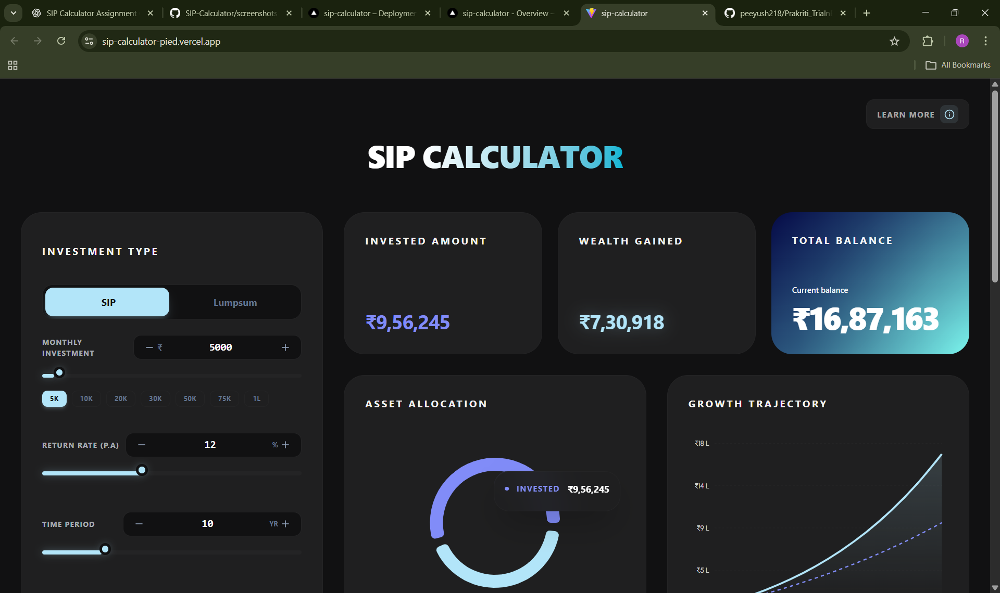
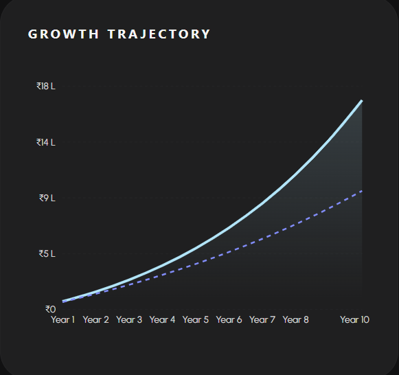
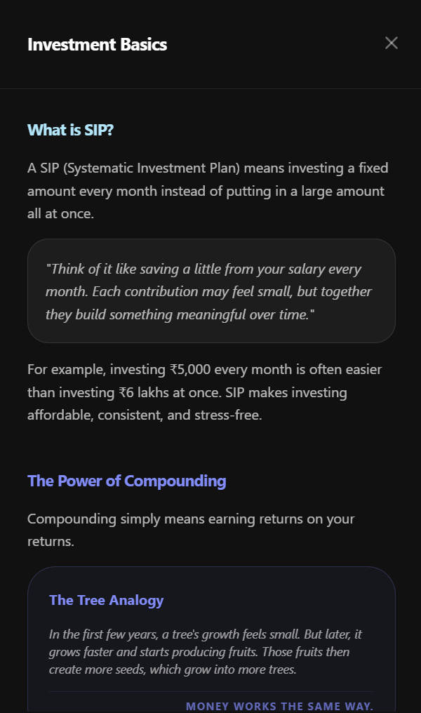
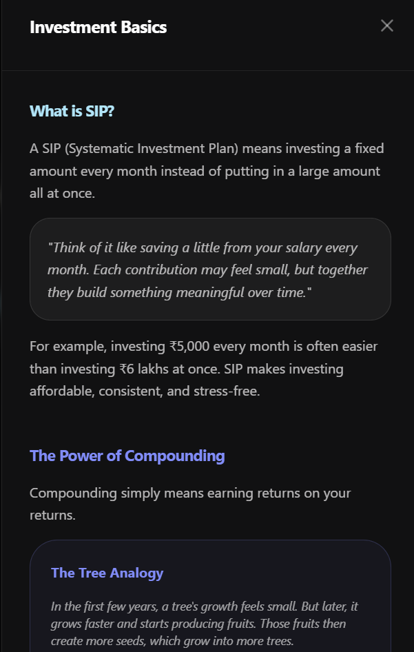
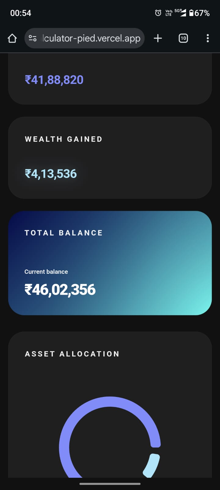

# SIP Calculator

> Plan your financial future with confidence! This interactive SIP calculator helps you visualize how your monthly investments can grow over time.

## What's This About?

Ever wondered how much wealth you could build by investing a little every month? That's exactly what this calculator helps you figure out!

**SIP (Systematic Investment Plan)** is like putting aside a fixed amount from your salary every month. Instead of trying to save a huge lump sum, you invest consistently—and let the magic of compounding do its thing.

Think of it like planting a tree. Small contributions today = big returns tomorrow.

## What Can You Do?

- **Calculate Returns**: Enter your monthly investment, expected return rate, and time horizon to see how much you could make
- **Visual Growth Charts**: Watch your money grow over time with beautiful, interactive charts
- **SIP vs Lumpsum**: Compare different investment strategies side-by-side
- **Goal Planning**: Planning for a car, house, or trip? Set your target and see if your SIP can get you there
- **Annual Step-Up**: Want to increase your investment by 10% every year? We've got you covered
- **Learn as You Go**: Educational sidebar explains investing concepts in plain English (no jargon, promise!)
- **FAQ Section**: Got questions? We've answered the most common ones

## Key Features

### Smart Calculator
- Adjust monthly investment with sliders or type in exact amounts
- Set your expected return rate (the calculator uses realistic market expectations)
- Choose your investment timeline—short-term or long-term goals
- Instantly see your invested amount, returns, and total balance
- **Helpful tooltips everywhere** - Hover over any term you don't understand and get a simple explanation. New to investing? We've got your back!

### Beautiful Visualizations
- **Growth Trajectory Chart**: See exactly how your wealth compounds year by year
- **Asset Allocation Pie Chart**: Understand the split between your contributions and returns
- Color-coded insights make complex data easy to digest

### Goal Planner
Want to buy a car or save for your child's education? The goal planner helps you:
- Set specific financial targets
- Account for inflation (because ₹10 lakhs today ≠ ₹10 lakhs in 10 years)
- See if you're on track or need to adjust your investments

### Education First
We believe in financial literacy! The app includes:
- **Quick onboarding tour** when you first visit - learn what each icon and section does in seconds
- **"Learn More" sidebar** with bite-sized lessons on SIP, compounding, and market basics
- **Tooltips** throughout the interface
- **Real-world examples** to make concepts click

## Built With

This is a clean, frontend-only application:

- **HTML5** - Structure
- **CSS3** - Modern, responsive styling with smooth animations
- **JavaScript** - All the calculation logic and interactivity
- **Chart.js** - Those gorgeous charts you see

No frameworks, no bloat—just clean, efficient code.

**[Live Demo](https://sip-calculator-q9v29w6g3-rhythm-nirankaris-projects.vercel.app)**

```bash
# Clone this repo
git clone https://github.com/Rhythm-Nirankari/SIP-Calculator.git

# Jump into the folder
cd SIP-Calculator

# Open index.html in your browser
# That's it! No npm install, no build steps needed.
```

## How The Math Works

The calculator uses the standard future value formula for SIPs:

```
FV = P × [((1 + r)^n - 1) / r] × (1 + r)
```

**Where:**
- **P** = Monthly investment amount
- **r** = Monthly rate of return (annual rate ÷ 12 ÷ 100)
- **n** = Total number of months
- **FV** = Future value (what you'll have at the end)

Then we break it down:
- **Total Invested** = How much you actually put in
- **Wealth Gained** = The returns you earned
- **Total Balance** = Invested + Returns

The chart plots this growth year by year so you can literally see your money working for you!

### Main Dashboard


Clean, intuitive interface with all your calculations at a glance

### Growth Visualization


Watch your investments compound over time with interactive charts

### Educational Sidebar


Sidebar education panel explaining everything you need to know

### Goal Planner


Set targets and see if you're on track (spoiler: compound interest is powerful!)

### Mobile View


## Real Talk: What You Should Know

**This calculator is for educational purposes.** Here's what it assumes:

- You'll invest consistently every month (no skipping!)
- The return rate stays constant (real markets fluctuate, obviously)
- All returns compound monthly
- No taxes or fees are considered in the calculation

**Investment tip**: These are *estimates*, not guarantees. Markets go up and down. Always do your own research or talk to a financial advisor before making big decisions.

## Design Philosophy

We wanted to make financial planning feel less intimidating and more approachable:

### Accessibility First
- **Large, readable fonts** - Designed with older adults in mind. No squinting needed! Your parents and grandparents can use this comfortably.
- **High contrast text** for better readability
- **Tooltips on every term** - Hover over anything you don't understand for instant help

### Modern & Friendly
- **Dark theme** because it's easier on the eyes during long planning sessions (and looks cool)
- **Fresh color palette** - Cool blues and cyans instead of the usual boring red-and-green you see in traditional calculators. This isn't your bank's clunky calculator from 2005!
- **Smooth animations** that feel natural, not distracting
- **Gradient accents** for visual interest without overwhelming you

### User Experience
- **Guided onboarding** - First-time users get a quick tour explaining what each icon and section does
- **Mobile-first responsive design** because most people check their finances on their phones
- **Minimal clutter** so you focus on what matters - your financial goals

**Bottom line**: This should feel like a modern app, not a spreadsheet.
This calculator tries to hit the sweet spot—powerful enough to be useful, simple enough for anyone to understand.
Whether you're a college student planning your first investment or someone planning retirement, this tool is for you.

## License

MIT License - feel free to use, modify, and share!


## Get In Touch

Built with love by [Rhythm Nirankari](https://github.com/Rhythm-Nirankari)

Questions? Suggestions? Just want to say hi? Feel free to reach out!

---

**If you found this helpful, consider giving it a star!** It helps others discover the project.

**Remember**: The best time to start investing was yesterday. The second best time is today.

1. Clone the repository.
   ```bash
   git clone <repository-url>
   ```
2. Install dependencies.
   ```bash
   npm install
   ```
3. Run the development server.
   ```bash
   npm run dev
   ```
4. Open the link shown in the terminal (usually `http://localhost:5173`).

## Logic Explanation
### SIP Formula
The calculator uses the standard formula for the future value of an annuity due:
```
M = P × ({[1 + i]^n - 1} / i) × (1 + i)
```
Where:
- `P`: Monthly Investment Amount
- `i`: Monthly Interest Rate (Annual Rate / 12 / 100)
- `n`: Total Number of Payments (Years * 12)

### Lumpsum Formula
For one-time investments, the compound interest formula is used:
```
A = P(1 + r)^n
```
Where:
- `P`: Principal Amount
- `r`: Annual Interest Rate (Rate / 100)
- `n`: Time in Years

## Assumptions
- Compounding happens monthly for SIP and annually for Lumpsum (Standard market convention for calculators).
- The inflation rate is not considered in the "Estimated Returns".

## Developer
Developed for the Frontend Developer Role assignment at Anuyog Software.
